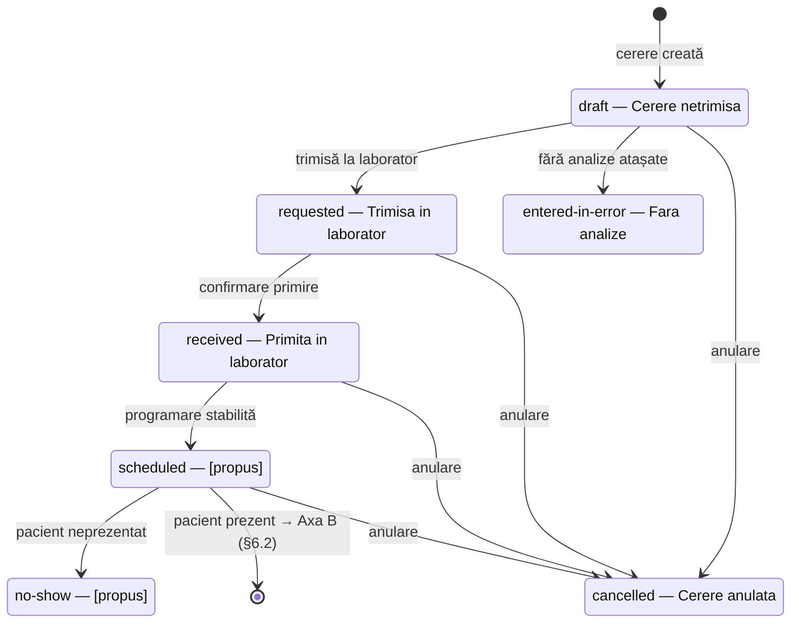
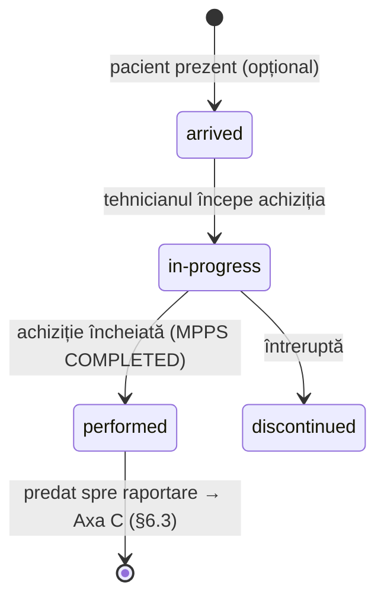
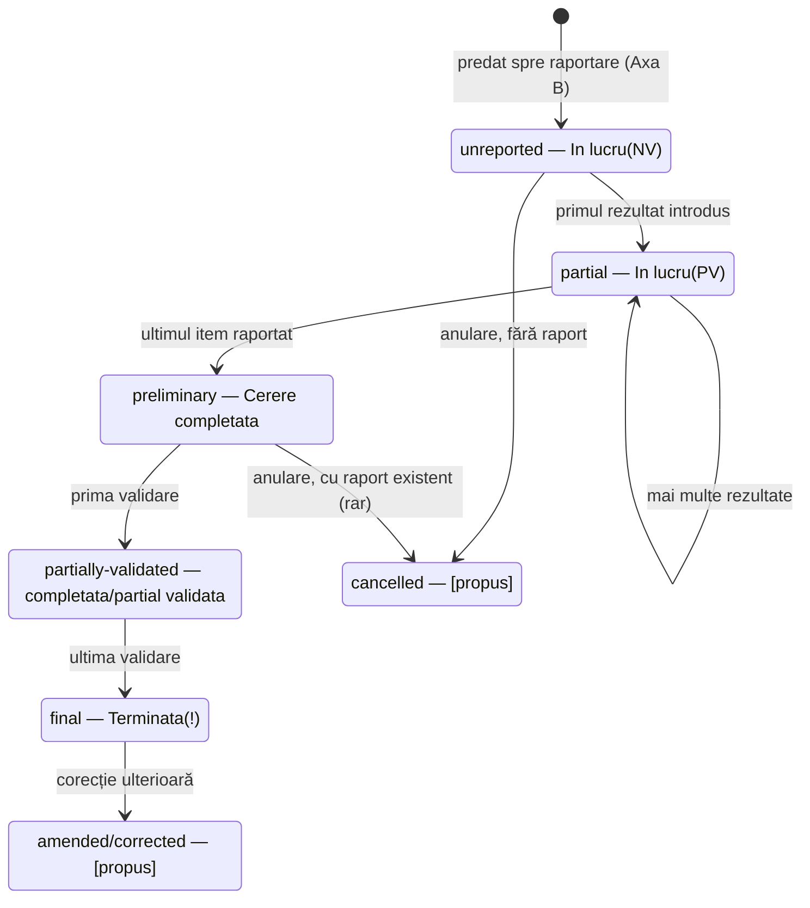
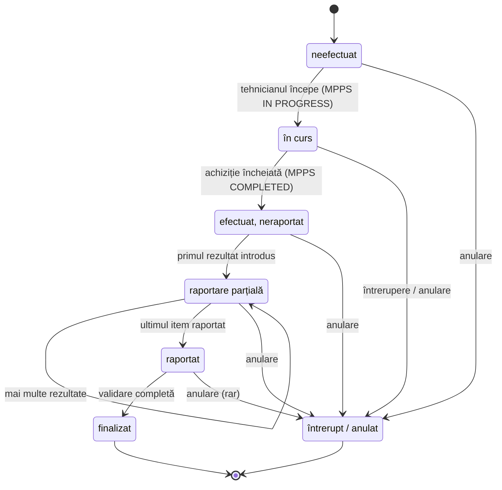

# Statusurile cererii de investigație în Hipocrate

Notă internă hippobridge — hartă verificată pe date live a statusurilor unei
cereri (`cerere.asp`), ipoteza pentru `(NV)`/`(PV)`, și punctul unde
informația "efectuat" se pierde complet, cu o cerere propusă pentru echipa
Hipocrate și, la final (§6), un model complet de statusuri pe trei axe —
comandă / execuție / raportare — cu toate statusurile lipsă completate și
maparea pe FHIR.

## 1. Cele 11 statusuri, confirmate live

Extrase din `/PARA/NOM/Listare/?id=44` (lista de programări), interogare
live pe 1.018 cereri, 2026-01-01 → 2026-08-09. Acesta e setul complet
observat — orice status care nu apare aici nu s-a ivit în 9 luni de cereri,
dar asta nu înseamnă că nu poate exista (vezi §4).

| Text Hipocrate | Văzut | Sens | Status FHIR (hippobridge) |
|---|---|---|---|
| `Cerere netrimisa` | 38 | Cererea a fost creată, nu a fost încă trimisă la laborator/secție. | `on-hold` |
| `Trimisa in laborator` | 104 | Trimisă la laborator; lucrul nu a început. | `draft` |
| `Primita in laborator` | 2 | Laboratorul a confirmat primirea; lucrul nu a început. | `draft` |
| `In lucru(NV)` | 0 în eșantion | În lucru, **niciunul** dintre analizele/itemii cerute nu are rezultat introdus încă. (ipoteză — vezi §2) | `active` |
| `In lucru(PV)` | 1 | În lucru, **unele, dar nu toate** itemii au rezultat introdus. (confirmat prin dovezi — vezi §2) | `active` |
| `Fara analize` | 76 | Cererea nu are nicio analiză atașată — o înregistrare goală/eronată. | `entered-in-error` |
| `Cerere completata` | 11 | **Toți** itemii ceruți au rezultat introdus; niciunul validat încă. | `completed` |
| `Cerere completata/partial validata` | 3 | Toți itemii raportați; unii (nu toți) validați. | `completed` |
| `Terminata` | 762 | Toți itemii raportați **și** validați. Starea terminală, pe fluxul normal. | `ended` |
| `Terminata!` | 15 | Identic cu de mai sus; semnul `!` nu a fost izolat încă la o condiție distinctă. | `ended` |
| `Cerere anulata` | 6 | Anulată — se loghează un actor și un timestamp (`"Cerere anulata de: …"`). | `revoked` |

## 2. Ce înseamnă probabil NV / PV

Hipocrate nu explică nicăieri abrevierea în marcaj sau JS (nu există tooltip,
nu există legendă). Dar `cerere.asp` expune un istoric de modificări pe
cerere la `ajax_modificari.asp?Id=…`, cu două secțiuni distincte —
**MODIFICARI / INTRODUCERI REZULTATE** (cine a introdus un rezultat și când)
și **VALIDARI REZULTATE** (cine l-a validat și când) — iar compararea
acestui istoric cu numărul de itemi ai cererii pe exemple live fixează
abrevierea comportamental, chiar și fără o definiție oficială din Hipocrate.

**Dovadă — cererea 1715945** (ES9634, status `In lucru(PV)`, 2 itemi ceruți):

```
Cerere introdusa de: FLORIN CRISTIAN DRAGOMIR — 11 Jun 2026 07:50

MODIFICARI / INTRODUCERI REZULTATE:
  IMAGISTICA PRIN REZONANTA MAGNETICA A CREIERULUI — ADRIAN DR. MARGARIT — 26 Jun 2026 10:35

VALIDARI REZULTATE:
  (gol — nimic validat)
```

**Dovadă — cererea 1742674** (status `Cerere completata`, 2 itemi ceruți):

```
MODIFICARI / INTRODUCERI REZULTATE:
  Anestezia generala, ASA 29 — Silviu Florin Mihaila — 07 Aug 2026 09:25
  IMAGISTICA PRIN REZONANTA MAGNETICA A CAPULUI — Rezident Garda Radiologie — 07 Aug 2026 12:23

VALIDARI REZULTATE:
  (gol — nimic validat)
```

**Tipar:** 1715945 are rezultat pentru 1 din 2 itemi → `PV`. 1742674 are
rezultat pentru 2 din 2 itemi → statusul trece direct de la "in lucru" la
`Cerere completata`. Niciuna dintre ele nu are vreo validare înregistrată,
dar niciuna nu poartă o etichetă legată de validare — deci `V` din
`NV`/`PV` pare să însemne *rezultat introdus*, nu *validat*:

- `NV` — **N**iciun rezultat **V**(izat/introdus): zero itemi raportați încă.
- `PV` — **P**arțial **V**(izat/introdus): unii, dar nu toți itemii, raportați.

> **Grad de încredere: ipoteză, neconfirmată.** Această interpretare se
> potrivește cu toate exemplele găsite live, dar hippobridge nu a văzut
> niciun caz live de `NV` care să testeze jumătatea "zero itemi raportați"
> a ipotezei, și nu am verificat dacă există un glosar oficial Hipocrate.
> Merită o întrebare directă (§5), nu tratată ca fapt stabilit.

## 3. Traiectoria, așa cum a fost observată

```
Cerere netrimisa
      │ trimisă la laborator
      ▼
Trimisa in laborator
      │ confirmare primire
      ▼
Primita in laborator
      │ începe lucrul
      ▼
In lucru(NV)  — 0/N itemi raportați
      │ primul rezultat introdus
      ▼
In lucru(PV)  — 1..N-1/N itemi raportați  ←─┐ (mai multe rezultate introduse)
      │ ultimul item raportat              │
      └─────────────────────────────────────┘
      ▼
Cerere completata — N/N raportați, 0 validați
      │ prima validare
      ▼
Cerere completata/partial validata
      │ ultima validare
      ▼
Terminata(!)  — N/N raportați ȘI validați

Din orice stare înainte de "in lucru": ──► Cerere anulata (anulare)
Din "Cerere netrimisa", dacă nu se atașează analize: ──► Fara analize
```

Firul comun: **raportarea** (cineva scrie constatările) și **validarea**
(cineva semnează) sunt urmărite ca două evenimente separate per item — dar
textul statusului codifică doar partea de raportare (`NV`/`PV`/completata)
sau starea complet validată (`terminata`). Nu există un status intermediar
care să spună "raportat, în așteptarea semnării" pentru o cerere cu un
singur item — vezi §4.

## 4. Golul real: "efectuat" nu e urmărit deloc

Tot ce e în §1–3 e din aval de *scrierea unui raport*. Nimic din acest
vocabular reflectă faptul că examinarea *s-a întâmplat* — un tehnician a
rulat aparatul, la o oră cunoscută, și niciun radiolog nu s-a uitat încă la
rezultat. Două lucruri confirmă că aici lucrurile nu funcționează cum ar
trebui:

- **`DataEfectuarii` ("Data Efectuarii") e manuală și decuplată de
  efectuarea reală.** E un simplu câmp de formular pe `cerere.asp`, setat
  doar când cineva declanșează acțiunea "Perform" (`hdnAction=S`) —
  de obicei chiar persoana care introduce raportul. Pe cererea live
  1715945 de mai sus, un radiolog introdusese deja constatările RMN, dar
  `Data Efectuarii` era încă goală (`"-"` în lista de programări). Câmpul
  care ar trebui să însemne "asta s-a întâmplat" nu se setează nici măcar
  după ce s-a întâmplat, demonstrabil.
- **Niciun câmp nu înregistrează cine a efectuat examinarea.** Istoricul
  de modificări are `RECOLTAT DE` / `RECEPTIONAT DE` (recoltat/primit
  probă — doar flux de laborator) și atribuirea introducerii rezultatului
  (*radiologul* care a scris constatările). Nu există un echivalent pentru
  tehnicianul/operatorul care a rulat aparatul de imagistică.

hippobridge are deja semnalul brut potrivit pentru asta: DICOM MPPS
(`ModalityPerformedProcedureStep`, adăugat în SCP-ul din `worklist.py` pe
2026-08-07, momentan doar în modul de observare) transportă exact *data/ora
efectuării* și *numele operatorului* direct de la aparat, independent de
orice acțiune umană ulterioară în Hipocrate. Până la această notă a
înregistrat **zero** mesaje MPPS — niciun aparat conectat nu îl trimite
încă — deci e neverificat în practică, dar e mecanismul care ar închide
acest gol odată conectat.

## 4.1 "Efectuat" a existat înainte de upgrade-ul Hipocrate — și s-a pierdut

Codul de dinainte de upgrade-ul Hipocrate din 2026-06-09 (commit `7c099a2`,
"fix: adapt all scrapers to Hipocrate server URL and HTML changes" — acolo
unde tot ce scana Hipocrate s-a rupt dintr-o dată) a fost verificat direct,
pentru comparație.

**Vocabularul de statusuri de la `cerere.asp` (netrimisa / trimisa / in
lucru NV·PV / terminata etc., §1–3) nu exista deloc înainte.** Clasele
`HipoClientCerere` și `HipoClientSchedule` nu existau — au fost adăugate
abia după rescriere, ca adaptare la noul Hipocrate. Deci nu există un
vocabular vechi cu care să comparăm; cel de mai sus e complet nou.

**Dar conceptul de "efectuat de către cineva" a existat, explicit, și acum
e cod mort.** Vechiul `HipoClientDiagnosticReport` (care citea pagina
tipărită `/analyse/Reports/analyseFile.asp`) avea o etichetă directă pe
pagină:

```python
# Extract performer (Efectuata de catre:)
data.store("study.performer", extract_text_after_label(soup, r'Efectuata de catre:'))
data.store("study.medic", extract_text_after_label(soup, r'MEDIC,|Medic validator:', ...))
```

„**Efectuata de catre:**” = „**Efectuat de către:**” — un câmp explicit pe
vechiul buletin care numea persoana care a *rulat* examinarea, distinct de
medicul care a validat rezultatul. E exact câmpul de "operator" cerut la
începutul acestei investigații.

Rescrierea din iunie 2026 a mutat parsarea pe `BuletinAnalize.asp`, care nu
mai are această etichetă (confirmat live — am verificat paginile curente
`BuletinAnalize.asp?type=1` și `?type=3` pentru un buletin de radiologie
"Terminata" și nu apare nicăieri "Efectuat"/"operator"/"tehnician"). Nimeni
nu a șters însă codul care *consuma* acel câmp — până la această notă,
`hippoclient.py` încă avea:

```python
# hippoclient.py, în HippoClientDiagnosticReport.fhir_response, înainte de fix
performer = parsed_data.get("study.performer")   # niciodată populat din iunie 2026
if performer:
    fhir_report["performer"] = [...]
medic = parsed_data.get("study.medic")            # la fel
if medic:
    fhir_report["resultsInterpreter"] = [...]
```

Așadar câmpurile `DiagnosticReport.performer` și `.resultsInterpreter` din
răspunsurile FHIR au fost goale, în tăcere, de la upgrade încoace — nu
pentru că Hipocrate nu mai urmărește cine a efectuat/validat o analiză, ci
pentru că eticheta s-a mutat pe altă pagină și nimeni nu a actualizat codul
care o citea. (Informația de *validare* per-analiză tot ajunge în FHIR, prin
`presentedForm[].validator`/`validation_date`, populate din eticheta
curentă `Validat de:` — doar "cine a efectuat fizic examinarea" a rămas
neacoperit.)

**Corectare aplicată:** codul mort (`study.performer`/`study.medic` +
citirea lor în `fhir_response`) a fost eliminat din `hippoclient.py` — nu
exista nimic de restaurat, pentru că eticheta "Efectuata de catre:" nu mai
are echivalent pe nicio pagină curentă. Rămâne un argument concret pentru
cererea de la §5: Hipocrate *chiar avea* această informație înainte, pe
interfața proprie — nu e o cerință nouă, doar una pierdută la migrare.

## 5. Cerere propusă către echipa de dezvoltare Hipocrate

> **Către:** Echipa de dezvoltare Hipocrate
> **De la:** hippobridge / integrare radiologie
> **Subiect:** Un status pentru "efectuat, în așteptarea raportului", și
> confirmarea NV/PV

Integrăm DICOM MPPS pentru ca hippobridge să afle în momentul în care un
aparat termină o examinare — ora exactă, plus operatorul care a rulat-o —
independent de orice acțiune în Hipocrate. În acest moment nu există unde
să ajungă această informație:

1. **Vă rugăm confirmați ce înseamnă `(NV)` și `(PV)`** la statusul "In
   lucru", și dacă interpretarea noastră e corectă: `NV` = niciun item
   raportat încă, `PV` = unii, dar nu toți itemii, raportați (vezi dovezile
   de mai sus). Dacă există un glosar intern pentru întregul vocabular de
   statusuri al unei `cerere`, ne-ar economisi timpul de a-l re-deduce din
   comportament.
2. **Există statusuri pe care nu le-am văzut?** Am observat doar cele 11
   texte de mai sus, pe ~1.000 de cereri live, în 9 luni (de exemplu, nu
   am întâlnit niciodată un caz de "neprezentare" sau "reprogramare", dacă
   acestea există ca stări distincte și nu sunt tratate altfel).
3. **Un status distinct pentru "examinare efectuată, fără raport încă"** —
   ceva de tipul `Efectuat, neexaminat` — separat de `In lucru(NV)`, care
   azi e imposibil de deosebit de "neînceput". Aceasta e starea în care o
   examinare stă oricât durează până când un radiolog o preia, și în acest
   moment e invizibilă. Vezi §6.2 pentru propunerea completă — nu ca status
   unic în același șir, ci ca axă separată de "s-a efectuat fizic
   examinarea", independentă de raportare.
4. **O modalitate de a seta `Data Efectuarii` (și, ideal, un câmp pentru
   operator/tehnician) independent de introducerea unui raport** — un apel
   API sau un POST pe care hippobridge să îl poată face când MPPS confirmă
   finalizarea, în loc ca acest câmp să fie setat doar ca efect secundar al
   faptului că cineva a scris constatările.
5. **Nu e o cerință nouă** — vechea pagină de buletin (dinainte de
   actualizarea din iunie 2026) avea o etichetă explicită "Efectuata de
   catre:" cu numele persoanei care a rulat examinarea, distinctă de
   medicul validator. S-a pierdut la migrarea pe `BuletinAnalize.asp` și nu
   are echivalent azi pe nicio pagină pe care o citim. Am dori pur și
   simplu să recăpătăm acea informație, în orice formă e disponibilă acum.

Putem trimite payload-urile MPPS brute de îndată ce un aparat chiar ne
trimite unul, dacă ajută la definirea domeniului.

## 6. Propunere: model de statusuri pe trei axe

Diagnosticul din §1–§4 are un tipar comun: fiecare gol identificat —
ambiguitatea `NV`/`PV` (§2), imposibilitatea de a distinge "efectuat" de
"neînceput" (§4), lipsa unui status pentru neprezentare/reprogramare
(§5.2) — vine din faptul că **un singur șir de status** încearcă să
codifice trei lucruri independente: dacă cererea a fost **rutată**, dacă
examinarea a fost **efectuată fizic**, și dacă **raportul** a fost scris
și semnat. Aceste trei axe nu avansează mereu împreună — o radiografie
portabilă STAT poate fi efectuată și raportată în câteva minute; un RMN de
rutină poate sta "programat" săptămâni fără ca nimic altceva să se
schimbe. Un enum plat nu poate reprezenta corect asta, indiferent de câte
texte i s-ar mai adăuga.

Mai jos: cele trei axe separate, complet cu statusurile lipsă identificate
în §2/§4/§5, plus cum se mapează pe FHIR-ul pe care hippobridge deja îl
expune.

### 6.1 Axa A — Flux comandă (workflow)

| Status | Sens | Hipocrate azi |
|---|---|---|
| `draft` | Creată, netrimisă | `Cerere netrimisa` |
| `requested` | Trimisă la laborator/secție | `Trimisa in laborator` |
| `received` | Laboratorul a confirmat primirea | `Primita in laborator` |
| `scheduled` | Programare (dată/oră) stabilită | **lipsă azi** |
| `no-show` | Pacientul nu s-a prezentat la programare | **lipsă azi** (întrebat la §5.2) |
| `cancelled` | Anulată înainte de efectuare | `Cerere anulata` (nediferențiată de anularea post-raport) |
| `entered-in-error` | Înregistrare goală/eronată | `Fara analize` |

### 6.2 Axa B — Execuție procedură (complet lipsă azi — golul din §4)

| Status | Sens |
|---|---|
| `arrived` | Pacientul s-a prezentat la aparat (opțional, dar util) |
| `in-progress` | Tehnicianul achiziționează imaginile — MPPS `IN PROGRESS` |
| `performed` | Imagini achiziționate, fără raport încă — exact starea "Efectuat, neexaminat" cerută la §5.3 — MPPS `COMPLETED` |
| `discontinued` | Începută dar întreruptă (defecțiune, pacient intolerant, reacție la contrast) — azi indistinctă de "neînceput" |

### 6.3 Axa C — Raportare/semnare (vocabularul existent al Hipocrate, făcut explicit)

| Status | Sens | Hipocrate azi |
|---|---|---|
| `unreported` | 0/N itemi au rezultat | `In lucru(NV)` |
| `partial` | 1..N-1/N itemi au rezultat | `In lucru(PV)` |
| `preliminary` | N/N raportate, 0 validate | `Cerere completata` |
| `partially-validated` | N/N raportate, unele validate | `Cerere completata/partial validata` |
| `final` | N/N raportate ȘI validate | `Terminata`/`Terminata!` |
| `amended`/`corrected` | Modificat după finalizare | **lipsă azi** — un raport corectat post-semnare e indistinct de unul original |
| `cancelled` | Raport anulat după ce a existat (pacient greșit, duplicat) | nediferențiat de anularea pre-efectuare |

### 6.4 Graficele celor trei axe







### 6.5 Recomandare de reprezentare FHIR

hippobridge expune deja `HippoClientCerere` ca `/fhir/Task/{id}` — iar
`Task.status` (`draft | requested | received | accepted | rejected |
ready | cancelled | in-progress | on-hold | failed | completed |
entered-in-error`) acoperă aproape direct **Axa A**, cu o
extensie/`Task.executionPeriod` pentru **Axa B** (exact ce cere §5.4 — un
mod de a seta "efectuat" independent de introducerea raportului), iar
`DiagnosticReport.status` (`registered | partial | preliminary | final |
amended | corrected | cancelled | entered-in-error`) e vocabularul
standard, deja definit de spec, pentru **Axa C** — mai bun decât
inventarea unui cod nou.

De observat: mapările curente folosesc `ended` pentru `Terminata` (§1), dar
`ended` nu e un cod FHIR valid pentru `ServiceRequest.status` (setul valid
e `draft | active | on-hold | revoked | completed | entered-in-error |
unknown`; `Encounter` folosește `finished`, nu `ended`). Merită corectat în
`hippoclient.py` (`HippoClientSchedule._FHIR_STATUS`) și `worklist.py`
(`_HIPOCRATE_TO_FHIR`) separat de soarta acestei propuneri — e un bug
intern, nu ceva de cerut echipei Hipocrate.

Trei resurse separate, trei axe separate — nu un enum mai lung.

## 7. Flux simplificat pentru implementare (doar execuție + raportare)

Axa A (flux comandă, §6.1) rămâne neimplementată deocamdată — e o piesă
lipsă în întregime azi (nu există niciun semnal Hipocrate pentru
"programat"/"neprezentare"), și se va aborda separat, la momentul
potrivit. Ce rămâne de implementat efectiv acum, cu semnale disponibile
azi sau imediat ce MPPS iese din modul de observare, e Axa B (execuție) și
Axa C (raportare) — dar combinate într-un model mai simplu decât cele 11
stări separate din §6.2/§6.3, redus la ce chiar contează pentru un
utilizator care se uită la statusul unei cereri.

### 7.1 Stările reduse

| Stare | Sens | Sursă semnal |
|---|---|---|
| `neefectuat` | Nicio achiziție încă. Stare implicită, înainte de orice semnal MPPS. | (implicit) |
| `în curs` | Tehnicianul achiziționează imaginile. | MPPS `IN PROGRESS` |
| `efectuat, neraportat` | Achiziție încheiată, 0 itemi raportați — starea "Efectuat, neexaminat" cerută la §5.3. | MPPS `COMPLETED` |
| `raportare parțială` | 1..N-1 itemi raportați. | `In lucru(PV)` |
| `raportat` | N/N itemi raportați, indiferent de stadiul validării (simplificare — vezi §7.2). | `Cerere completata` / `.../partial validata` |
| `finalizat` | N/N raportați ȘI validați complet. | `Terminata`/`Terminata!` |
| `întrerupt / anulat` | Ramură de ieșire unică, accesibilă din orice stare de mai sus — fie procedura a fost întreruptă (Axa B), fie cererea/raportul a fost anulat (Axa C). | MPPS `DISCONTINUED` / `Cerere anulata` |

Șapte stări, un singur flux principal liniar plus o singură ramură de
excepție — față de cele 11 din modelul complet.

### 7.2 Ce s-a redus față de modelul complet (§6.2–§6.3)

- **`arrived` (Axa B) a fost eliminat** — nu are o sursă de semnal fiabilă
  azi (nu face parte din vocabularul standard MPPS) și nu aduce nimic în
  plus față de ce oferă deja `în curs`.
- **`preliminary` + `partially-validated` (Axa C) au fost unificate în
  `raportat`** — diferența dintre "0 validate" și "parțial validate" e o
  nuanță utilă pentru audit, dar nu schimbă ce trebuie să facă cineva care
  se uită la status: raportul există, așteaptă semnătura finală. Dacă se
  dovedește necesară mai târziu, distincția poate reveni ca un câmp
  auxiliar (`validated_count`/`total_count`), nu ca stare separată.
- **`discontinued` (Axa B) și `cancelled` (Axa C) au fost unificate în
  `întrerupt / anulat`** — ambele înseamnă azi, practic, "acest flux nu se
  mai termină normal"; separarea lor n-are un consumator concret azi.
- **`amended`/`corrected` (Axa C) a fost eliminat ca stare separată** — un
  raport corectat rămâne `finalizat`; corectarea se poate urmări separat
  (istoricul de modificări de la `ajax_modificari.asp`, deja disponibil),
  nu ca tranziție de stare vizibilă.
- **Axa A a fost eliminată complet din acest model** — se implementează
  separat, ca etapă ulterioară.

### 7.3 Graficul fluxului simplificat



---

*Surse: interogări live pe `/api/schedule` și
`/api/debug?path=/para/nom/listare/ajax_modificari.asp` prin hippobridge,
2026-08-09 · maparea status↔FHIR reflectă `hippoclient.py`
(`HippoClientSchedule._FHIR_STATUS`) și `worklist.py`
(`_HIPOCRATE_TO_FHIR`) · instrumentare MPPS: commit `9bebb8d` · modelul pe
trei axe (§6): 2026-08-10 · fluxul simplificat, doar execuție + raportare
(§7): 2026-08-10.*
